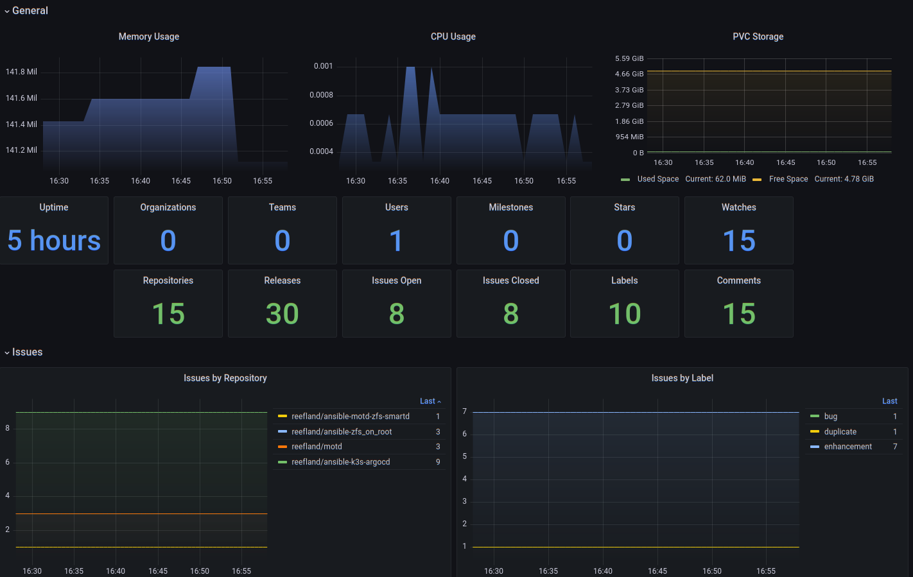

# Gitea Dashboard

Monitor Gitea Source Control Repositories.



Dashboard to monitor Gitea deployed as on Kubernetes. Can also monitor Gitea’s PVC storage space.

The `app.ini` needs to have at least the following in the metrics section:

```ini
[metrics]
  ENABLED = true
  ENABLED_ISSUE_BY_REPOSITORY=true
  ENABLED_ISSUE_BY_LABEL=true
```

Available on [Grafana](https://grafana.com/grafana/dashboards/17802-gitea-dashbaord/) as ID: `17802`

[Back to Dashboard List](../README.md)
