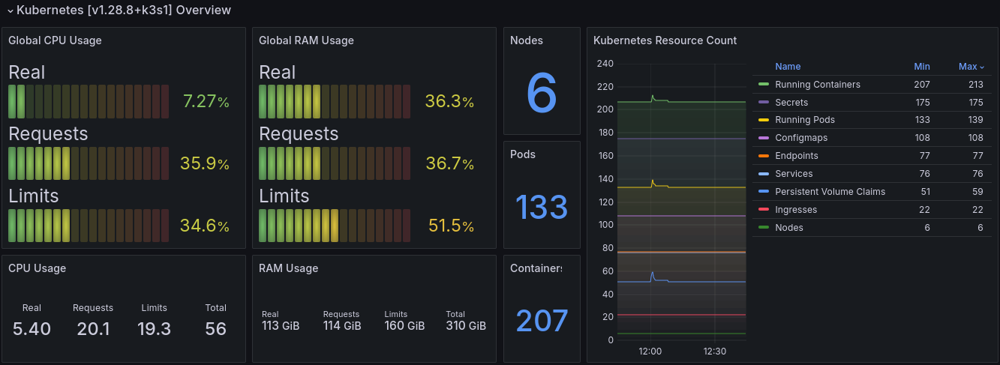
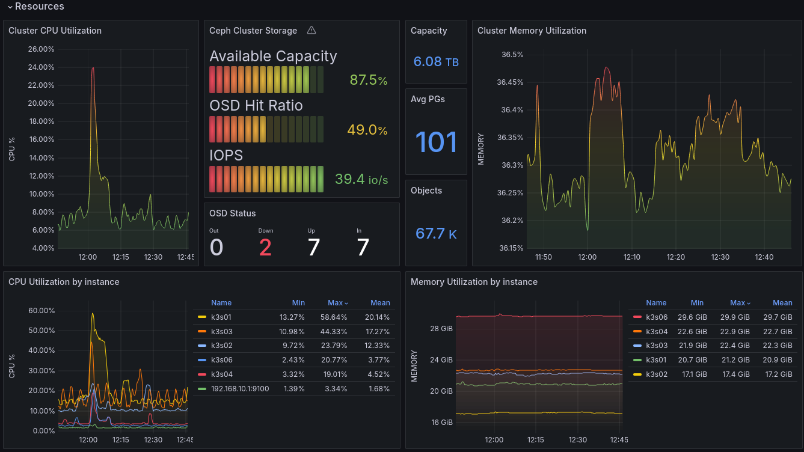
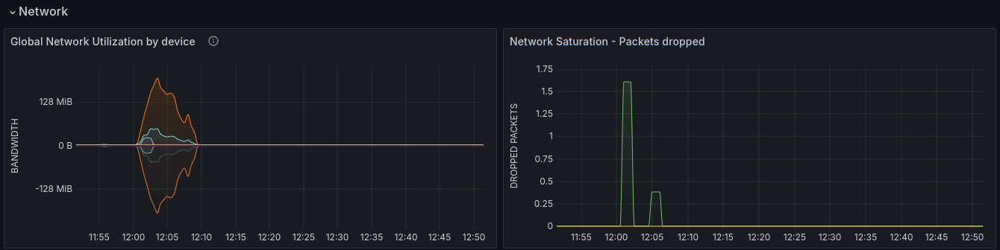

# K3s with Ceph Rook Dashboard

A K3s Cluster Global Overview with highlights of Ceph Rook Storage.

Based on work from <https://github.com/dotdc/grafana-dashboards-kubernetes>.

Customized to include highlights of Global CPU Usage, Global RAM Usage, Nodes, Pods and Containers running, Kubernetes Resource Count summary, Ceph Storage Capacity, OSD Hit Ratio, current IOPS, and high-level OSD counts.

Available on [Grafana](https://grafana.com/grafana/dashboards/22666-mosquitto-mqtt-broker/) as ID: `22666`

[Back to Dashboard List](../README.md)
