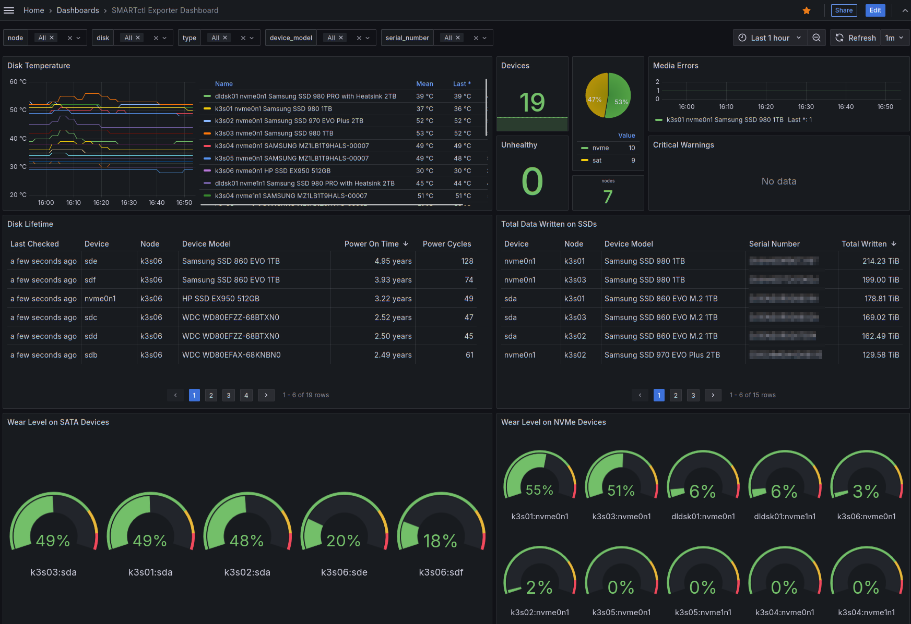

# SMARTctl Exporter Dashboard

Extended smartctl-exporter Dashboard

A dashboard for Prometheus smartctl-exporter <https://github.com/prometheus-community/smartctl_exporter>. Provides details on temperature, disk lifetime, amount of data written and wear level indicators for devices which provide it.

Available on [Grafana](https://grafana.com/grafana/dashboards/22604-smartctl-exporter-dashboard/) as ID: `22604`

[Back to Dashboard List](../README.md)
