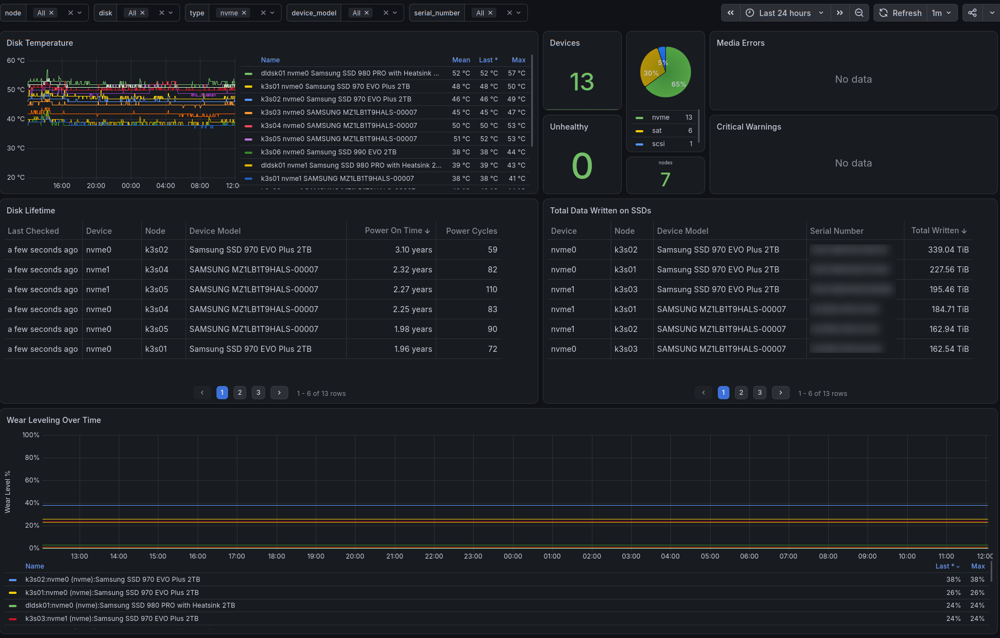

# SMARTctl Exporter Dashboard

Extended smartctl-exporter Dashboard



A dashboard for Prometheus smartctl-exporter <https://github.com/prometheus-community/smartctl_exporter>. Provides details on temperature, disk lifetime, amount of data written and wear level indicators for devices which provide it.

Available on [Grafana](https://grafana.com/grafana/dashboards/22604-smartctl-exporter-dashboard/) as ID: `22604`

## smartctl-exporter Version Compatibility

Starting with smartctl-exporter `0.15.0`, the `smartctl_device_temperature` metric has a `temperature_type` label. Along with the current temperature (`temperature_type="current"`), the exporter also exports each drive's temperature limits as series of the same metric (`op_limit_max`, `critical_limit_max` and `drive_trip`).

Dashboard revision 3 and earlier average all `smartctl_device_temperature` series per drive. With exporter `0.15.0` or newer, the Disk Temperature panel shows inflated values (NVMe drives typically read 20-30°C hotter than actual).

Revision 4 filters the temperature query with `temperature_type=~"current|"`. This works with exporter `0.15.0` and newer, and with older versions that do not have the `temperature_type` label.

If you have alert rules based on `smartctl_device_temperature`, add the same filter to them. Otherwise the drive limit values will trigger false high temperature alerts, for example:

```yaml
expr: smartctl_device_temperature{temperature_type=~"current|"} > 65
```

[Back to Dashboard List](../README.md)
