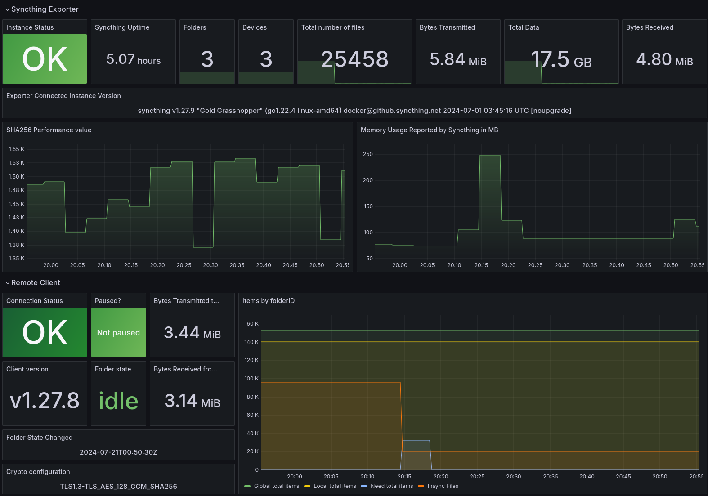

# Syncthing Exporter Dashboard

Dashboard for Syncthing Exporter <https://github.com/f100024/syncthing_exporter>.

I was unable to get the Project’s example dashboard from GitHub working. In the end I redesigned it.

Tested with Kube Prometheus Stack, Grafana, Syncthing exporter, syncthing all running within Kubernetes.

Available on [Grafana](https://grafana.com/grafana/dashboards/21557-syncthing-exporter-0-3-7/) as ID: `21557`

[Back to Dashboard List](../README.md)
