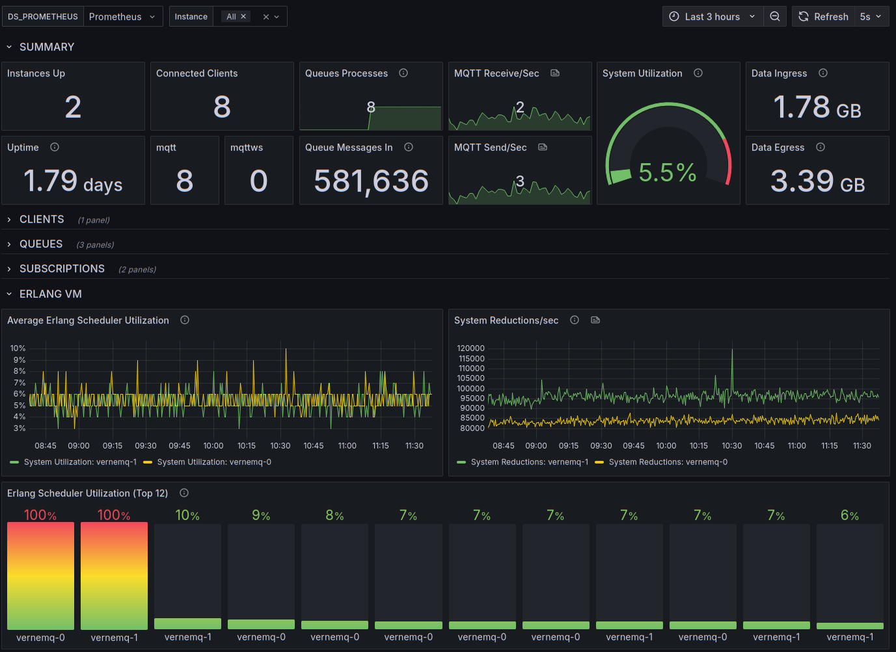

# VerneMQ Cluster Metrics Dashboard

VerneMQ MQTT Message Broker dashboard supporting multiple instances on Kubernetes.

A dashboard for VerneMQ MQTT Message Broker <https://github.com/vernemq/docker-vernemq>. Provides on overview of VerneMQ cluster operations with details for:

* Client Connect/Disconnect Rates
* Queue totals, Setup/Teardown Rates, messages in queues.
* Subscriptions Totals, Routing Table Size.
* Erlang VM Scheduler Utilization, System Reductions, ContextSwitches, System I/O, Run Queue, Garbage Collection.
* Data Rates IN / OUT.
* Retained Messages, Retained Message Memory Use.
* TCP Socket / Cluster Inter-Communication Data Rates.
* MQTT Connection Rates / Errors.
* MQTT Subscribe / Unsubscribe Rates.
* MQTT Publish Rates by QOS.

Available on [Grafana](https://grafana.com/grafana/dashboards/23485-vernemq-cluster/) as ID: `23485`

[Back to Dashboard List](../README.md)
