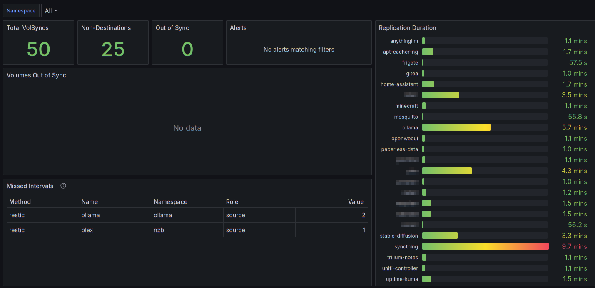

# VolSync Dashboard

Provides a basic dashboard for VolSync. See Project <https://github.com/backube/volsync>.

Provides a general overview of VolSync replication status. If volumes are out of sync, it will be indicated. Replication Duration gives an estimate of how long the sync jobs are running for that volume.

Available on [Grafana](https://grafana.com/grafana/dashboards/21356-volsync-dashboard/) as ID: `21356`

[Back to Dashboard List](../README.md)
